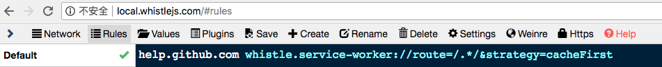
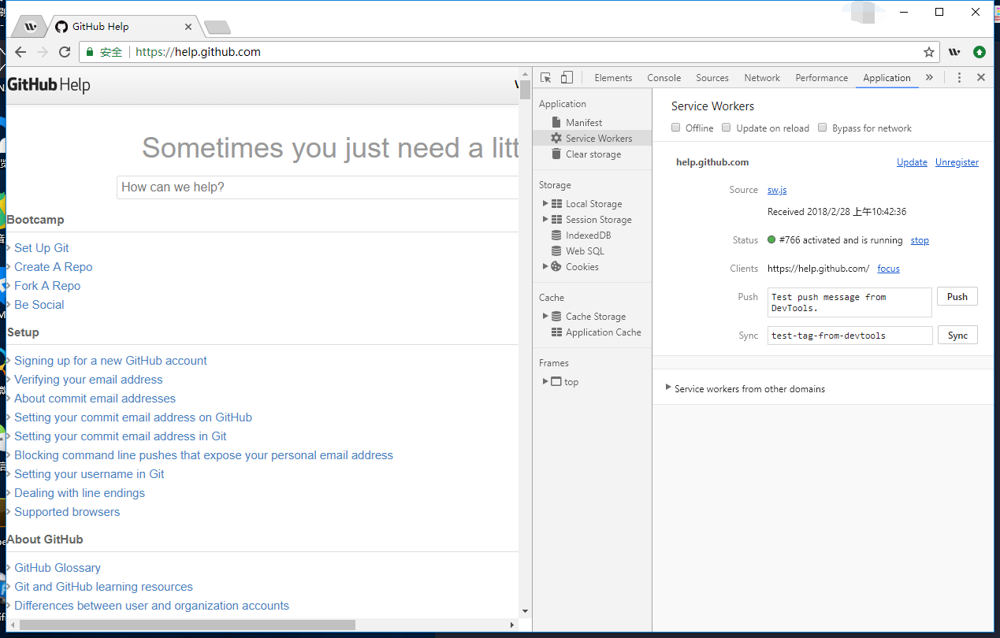
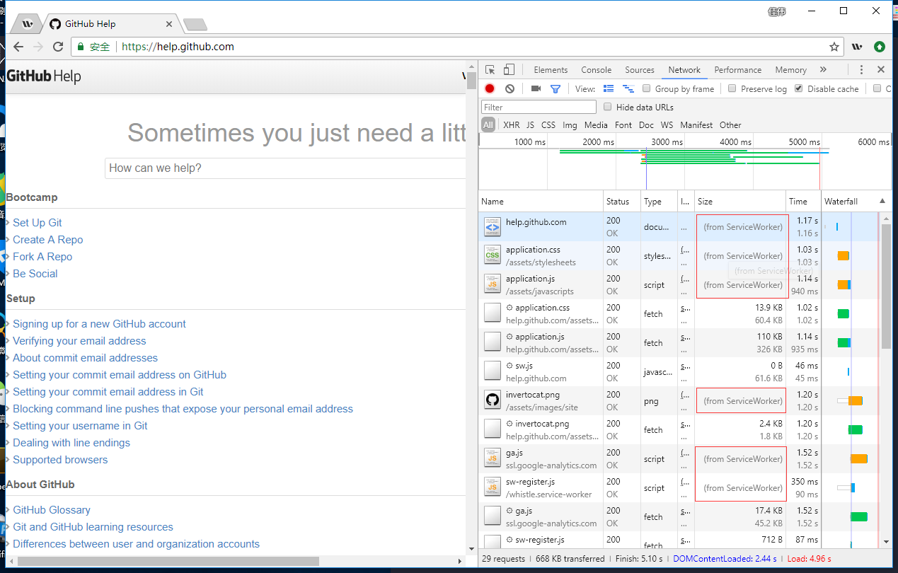

[](https://www.npmjs.com/package/whistle.service-worker)
[](https://www.npmjs.com/package/whistle.service-worker)
[](https://github.com/elvinn/whistle.service-worker)
[](https://standardjs.com)

# whistle.service-worker ([中文文档](https://github.com/elvinn/whistle.service-worker/blob/master/README_CN.md))

As a plugin of [whistle](https://github.com/avwo/whistle), whistle.service-worker tests the effect of service worker for sites which want to use.

## Installation
Install packages with npm globally:

```shell
$ npm install --global whistle whistle.service-worker
```

Set proxy to `127.0.0.1:8899`. [Whistle Doc - Proxy Setting](https://github.com/avwo/whistle#%E8%AE%BE%E7%BD%AE%E4%BB%A3%E7%90%86) may help.

## Example

Suppose to test the effect of service worker for [Github Help](help.github.com):

1. Start whistle:

```shell
$ w2 start
```

2. Open http://local.whistlejs.com/#rules in browser.

3. Add following rule to whistle:

```shelll
help.github.com whistle.service-worker://route=/.*/&strategy=cacheFirst
```


4. Open [Github Help](https://help.github.com/) in new tab and check whether service worker is registered in devtools.



5. Refresh [Github Help](https://help.github.com/) and check network pannel in devtools.




## Doc

The key point for users is to set whistle rules like `/help.github.com/ whistle.service-worker://route=/.*/&strategy=cacheFirst` :

- `help.github.com` means the hostname of the site to test.
- `route=/.*/` means to interception request which's url matches RegExp `/.*/` by service worker.
- `strategy=cacheFirst` is to set a caching strategy. The built-in strategies are:
  - cacheFirst
  - cacheOnly
  - networkFirst
  - networkOnly
  - staleWhileRevalidate

## ChangeLog

[ChangeLog](https://github.com/elvinn/whistle.service-worker/blob/master/CHANGELOG.md)

## Thans List
- [Google Workbox](https://github.com/GoogleChrome/workbox)
- [whistle.swmock](https://github.com/whistle-plugins/whistle.swmock)
- [avwo](https://github.com/avwo)

## Licence
[MIT](https://github.com/elvinn/whistle.service-worker/blob/master/LICENSE)

