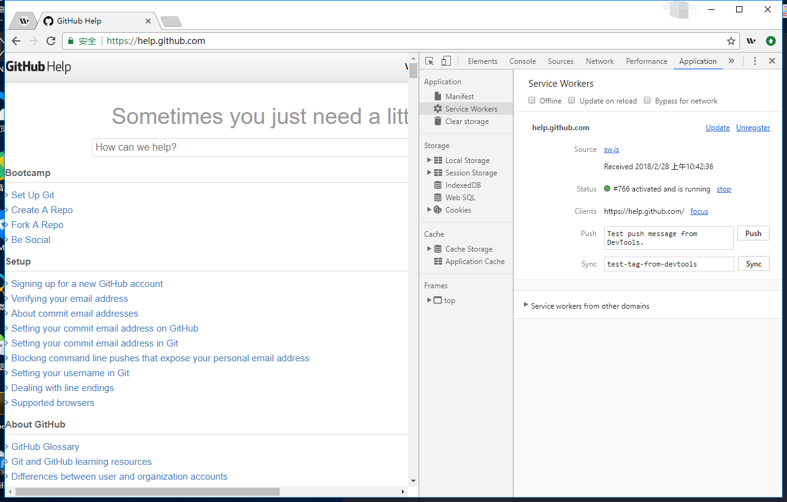
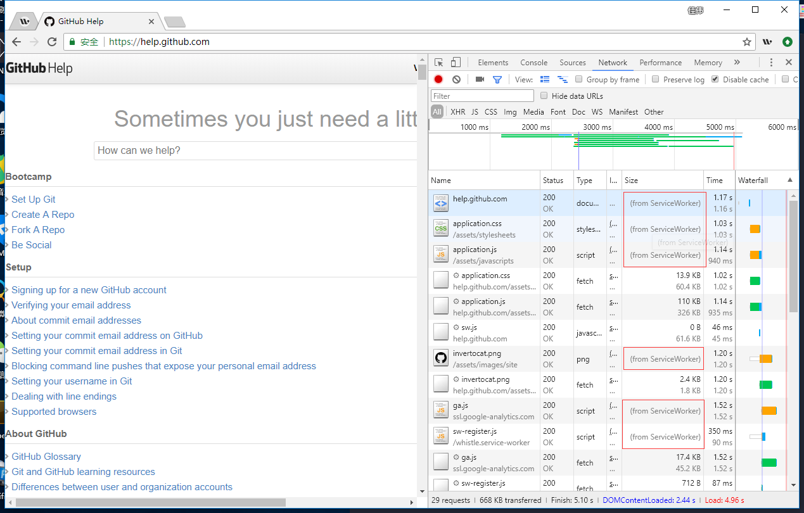

[](https://www.npmjs.com/package/whistle.service-worker)
[](https://www.npmjs.com/package/whistle.service-worker)
[](https://github.com/elvinn/whistle.service-worker)
[](https://standardjs.com)

# whistle.service-worker

作为 [whistle](https://github.com/avwo/whistle) 的一款插件，whistle.service-worker 可以为想要使用 service worker 的网站测试效果。

## 安装
用 npm 全局安装：

```shell
$ npm install --global whistle whistle.service-worker
```

将代理设置为 `127.0.0.1:8899`。[Whistle 文档 - 代理设置](https://github.com/avwo/whistle#%E8%AE%BE%E7%BD%AE%E4%BB%A3%E7%90%86) 可能会有帮助。

## Example

假设我们想测试 [Github Help](help.github.com) 使用 service worker 后的效果:

1. 启动 whistle:

```shell
$ w2 run
```

2. 在浏览器中打开 http://local.whistlejs.com/#rules.

3. 在 whistle 中添加如下规则:

```shelll
/help.github.com/ whistle.service-worker://route=/.*/&strategy=cacheFirst
```


4. 在浏览器中打开 [Github Help](https://help.github.com/) 并在开发者工具中检查 service worker 是否注册成功。



5. 刷新 [Github Help](https://help.github.com/) 后即可观察启用 service worker 的效果。




## Doc

对于本插件的使用者而言，关键在于设置 whistle 的规则， 以 `/help.github.com/ whistle.service-worker://route=/.*/&strategy=cacheFirst` 为例:

- `/help.github.com/` 指定了要测试的网站.
- `route=/.*/` 通过正则 `/.*/` 设置了 service worker 要拦截的请求.
- `strategy=cacheFirst` 设置了 service worker 采取的缓存策咯. 支持的策咯有:
  - cacheFirst
  - cacheOnly
  - networkFirst
  - networkOnly
  - staleWhileRevalidate

## 修改日志

[ChangeLog](https://github.com/elvinn/whistle.service-worker/blob/master/CHANGELOG.md)

## 感谢名单
- [Google Workbox](https://github.com/GoogleChrome/workbox)
- [whistle.swmock](https://github.com/whistle-plugins/whistle.swmock)
- [avwo](https://github.com/avwo)

## 证书
[MIT](https://github.com/elvinn/whistle.service-worker/blob/master/LICENSE)

